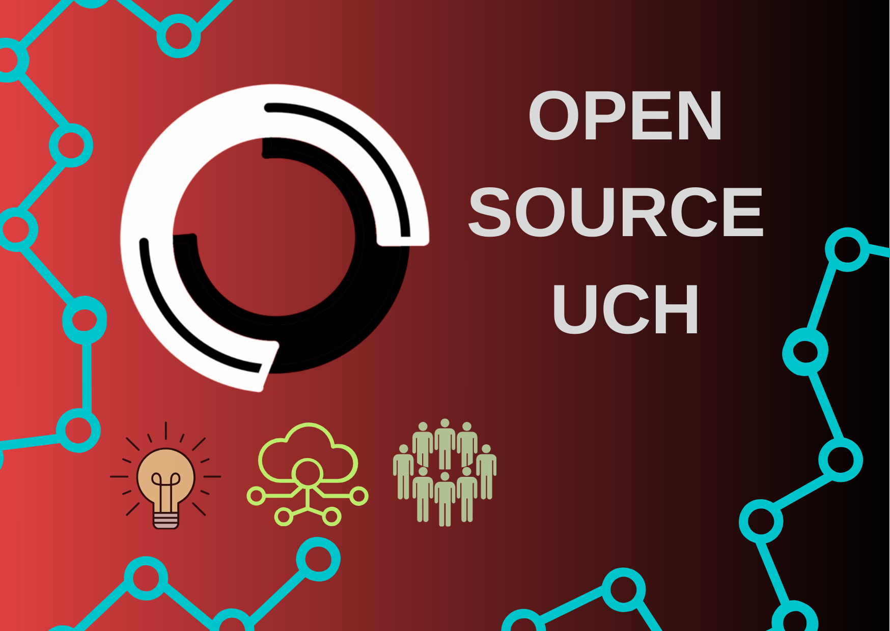

<h1 align="center">¡Bienvenid@ a Open Source UCH! 👋</h1>

  

Open Source UCH es una comunidad de estudiantes de la **Universidad de Chile** que colabora en el desarrollo de **proyectos de código abierto** con el objetivo de generar un impacto positivo en la sociedad. Nos enfocamos en promover el **trabajo en equipo**, el **aprendizaje continuo**, y la **exploración de nuevas herramientas** para impulsar nuestros proyectos.

### 🚀 ¿Cómo puedes unirte?
Únete a nosotros para **colaborar**, **aprender** y **contribuir al crecimiento de la comunidad**. Aquí tienes algunas formas de conectarte con nosotros:

### 🌐 Redes Sociales

  
  
  
  

### 📚 Proyectos Destacados
A continuación, puedes explorar los proyectos destacados que estamos desarrollando. Si te interesa contribuir o tienes alguna idea para un nuevo proyecto, ¡nos encantaría saber de ti!
